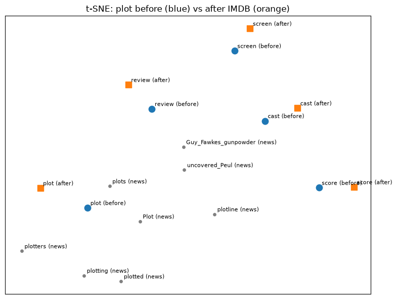

# DATA 266 — Homework 2

Sneha Singh  
SID4 = 0670 | SEED = 670 | SLICE = 670 | HP_ID = 4 | CLS_A = 0 | CLS_B = 5

Git repo: https://github.com/snehas-SJSU/Data266-0670/tree/main/HW-2

HP_ID 4 is only reported. This homework has no capacity / lr / schedule arm, so I did not change chunk size, epochs, or model size from it.

Notebooks: `embeddings.ipynb`, `rag.ipynb`, `optimizations.ipynb`, `amp_cuda_colab.ipynb`. Kernel: Python (HW1). Mixed precision ran on Colab Tesla T4.

---

## 1. Embedding transfer learning (4 points)

I loaded Google News Word2Vec (`word2vec-google-news-300`). 3,000,000 words, 300-d. Those vectors come from news, not movie reviews, so `plot` can look like a conspiracy and `screen` can look like a phone.

I copied the five word vectors first. Then I trained a Word2Vec model on 5,000 IMDB reviews (seed 670), after stuffing in the Google News vectors for words that overlap. That is the transfer step. `api.load` only gives KeyedVectors, which cannot `train()`, so I could not call `train()` on the downloaded object itself.

Words: `cast`, `score`, `plot`, `screen`, `review`.

### 1.1 Neighbors before and after

**Table 1 — top-3 nearest neighbors (cosine)**

| Word | Before (Google News) | After (IMDB) |
|------|----------------------|--------------|
| cast | casts=0.722; casting=0.719; Cast=0.664 | casting=0.726; actors=0.706; supporting=0.700 |
| score | scoring=0.720; scores=0.660; scored=0.638 | scores=0.678; scoring=0.675; scored=0.618 |
| plot | plots=0.762; Plot=0.652; plotting=0.633 | plots=0.729; story=0.719; storyline=0.699 |
| screen | screens=0.773; onscreen=0.612; LCD_screen=0.560 | screens=0.691; stage=0.619; theatre=0.593 |
| review | reviewed=0.663; reviewing=0.661; reviews=0.638 | reviews=0.784; uwe=0.694; seagal=0.687 |

`plot` and `screen` moved toward movie language. `cast` picked up actors / supporting. `score` barely moved — still the same word family (scoring / scores). `review` went to reviews plus IMDB junk (Uwe Boll / Seagal). That last one is ugly but it is what the 5,000 reviews did.

In this subset, `plot` showed up in 1015 reviews and `score` in only 178, which matches who moved.

### 1.2 Figure — t-SNE for `plot`

I picked `plot` because in news it often means a conspiracy (one neighbor was even Guy Fawkes) and in reviews it means the story.

**Figure 1.** Blue circles = Google News. Orange squares = after IMDB. Gray = original news neighbors of `plot`. This is only a 2D picture. Distances here are not cosine in 300-d. Table 2 is the real shift number.

### 1.3 How far each word moved

Lower cosine = the vector moved more.

**Table 2 — cosine(original, fine-tuned)**

| Word | cosine |
|------|--------|
| review | 0.7306 |
| plot | 0.7806 |
| screen | 0.7885 |
| cast | 0.8019 |
| score | 0.8618 |

- Shifted the most: **review**
- Shifted the least: **score**

---

## 2. RAG pipeline (4 points)

I loaded 10 Wikipedia movie pages with `WikipediaLoader`, split them (chunk 500, overlap 50), embedded with MiniLM, and stored them in an in-memory vector store. The pipeline is PromptTemplate + retriever + Flan-T5-small, called separately. I did not use one pre-built chain.

I picked colliding titles on purpose: *The Batman* / *Batman Begins* / *The Dark Knight*, and two *Dune* films. The other pages are Inception, Interstellar, Parasite, Titanic, The Godfather.

### 2.1 Five questions (chunk 500 / overlap 50)

| Q | Question | LLM answer | Top-1 source |
|---|----------|------------|--------------|
| 1 | Who directed The Batman? | Matt Reeves | The Batman (film) |
| 2 | In what year was Dune released as a film? | 2021 | Dune: Part Two (talking about the 2021 film) |
| 3 | Which award did Parasite win at Cannes? | Academy Award for Best Picture | Parasite (2019 film) |
| 4 | Who composed the score for Inception? | Nolan | Inception |
| 5 | Who played Jack Dawson in Titanic (1997)? | Leonardo DiCaprio | Titanic (1997 film) |

Full chunks are in `rag.ipynb`.

### 2.2 Chunk size change (Q1 and Q2)

I rebuilt the store with chunk **200 / overlap 20** and re-ran Q1 and Q2.

- Q1 still answered Matt Reeves. Rank 1 stayed *The Batman*. Ranks 2 and 3 became **Batman Begins** (Nolan / Bale). Smaller chunks made the Batman name collision worse. The 500/50 run had all three hits on *The Batman*.
- Q2 still answered 2021. *Dune: Part Two* was still ranked high.

### 2.3 Retrieval scoring (top-3, 500/50)

I scored retrieval by hand. The LLM can be wrong even when the chunk is right.

**Table 3**

| Q | Gold | In top-3? | Rank | Notes |
|---|------|-----------|------|-------|
| 1 | Matt Reeves, The Batman (film) | Yes | 1 | right page |
| 2 | Dune 2021 | Yes | 1 | year is in the chunks; rank 1 is the Part Two page |
| 3 | Palme d'Or at Cannes | Yes | 1 | Palme d'Or is in rank 1; LLM still said Oscar |
| 4 | Hans Zimmer | No | — | top-3 never name Zimmer |
| 5 | Leonardo DiCaprio as Jack Dawson | Yes | 2 | rank 1 is the Halifax grave labeled J. Dawson |

Retrieval Success Rate = **4 / 5 = 0.80**

### 2.4 Two RAG failures

**Failure A — Q4, relevant chunk not retrieved.** Gold is Hans Zimmer. The retriever stayed on Inception but the top-3 chunks are the opening (Nolan, DiCaprio), a screenplay paragraph, and Oscars / box office. Chunk 3 says nominated for Best Original Score and never names Zimmer. I only kept the first 15,000 characters of each Wikipedia page, so the composer section may not even be in the doc. The LLM answered **Nolan**, which is sitting in chunk 1.

**Failure B — Q3, context was right, LLM was not.** Gold is Palme d'Or. Rank 1 has Palme d'Or and also Academy Award for Best Picture, with the Oscar sentence first. Flan-T5 answered **Academy Award for Best Picture**. That is not a Cannes award. The retriever did its job. The small LLM copied the Oscar.

---

## 3. Training optimizations (2 points)

Same 12-layer MLP, width 512, batch 64, 40 Adam steps, lr 0.001, seed 670. Device: **mps** (Apple GPU) for tensor-create, init, checkpointing, and accumulation. `mem_mb` there is MPS current allocated memory, not CUDA peak, so it barely moves. Mixed precision is a separate CUDA run on Colab Tesla T4 (`amp_cuda_colab.ipynb`).

**Table 4**

Tensor create, 2048×2048, mean of 3 after warmup, with `torch.mps.synchronize()`:

| place | ms | mem_mb |
|-------|----|--------|
| cpu | 61.087 | n/a |
| mps | 2.167 | 0.1 |

Weight init (same net / data / steps):

| init | seconds | mem_mb | final_loss |
|------|---------|--------|------------|
| default | 4.559 | 28.4 | 1.4873 |
| xavier | 0.231 | 26.3 | 1.6886 |
| zeros | 0.204 | 26.3 | 2.2914 |

Checkpointing:

| checkpoint | seconds | mem_mb | final_loss |
|------------|---------|--------|------------|
| False | 0.273 | 26.3 | 1.4873 |
| True | 0.333 | 26.3 | 1.4873 |

Gradient accumulation (effective batch still 64, 40 opt steps):

| accum | micro | seconds | mem_mb | final_loss |
|-------|-------|---------|--------|------------|
| 1 | 64 | 0.395 | 26.3 | 1.4873 |
| 4 | 16 | 0.990 | 26.2 | 1.5353 |

Mixed precision (Colab Tesla T4, `amp_cuda_colab.ipynb`; same net / data / batch / steps):

| amp | seconds | peak_mem_mb | final_loss | forward dtype |
|-----|---------|-------------|------------|---------------|
| False | 0.2343 | 82.6 | 1.4924 | torch.float32 |
| True | 0.2688 | 82.6 | 1.4793 | torch.float16 |

Zeros init did not train (loss 2.29, about ln(10)). Default vs Xavier both went down. I am not reading 4.56 s vs 0.23 s as “default is slow.” Default was the first train on a cold MPS graph.

Checkpointing took longer (0.273 → 0.333) and loss matched. Memory did not drop on this MPS meter.

Accumulation: loss stayed close (1.49 vs 1.54), time went up because each step does four forwards.

Mixed precision used real fp16 on CUDA (`torch.autocast(..., dtype=torch.float16)` + GradScaler; probe `used_fp16: True`). Warmup was untimed. Times are the mean of 3 with `torch.cuda.synchronize()`. AMP was a little slower (0.2343 → 0.2688 s). CUDA peak memory stayed 82.6 MB. Loss stayed close (1.4924 vs 1.4793). This net is small; Tensor Cores did not help.

---

## 4. Short conclusion

Fine-tuning Google News on IMDB did move movie words. `plot` went toward story / storyline, `screen` toward stage / theatre, `review` moved the most (cosine 0.73). `score` moved the least (0.86) and still looks like sports morphology.

RAG retrieval was 4/5. The two misses I care about are Q4 (Zimmer never in the top-3, LLM said Nolan) and Q3 (Palme d'Or was in the chunk, LLM said Oscar anyway). Smaller chunks made Batman titles collide more.

On MPS, making a big tensor on GPU is faster than CPU. Checkpointing and accumulation behaved like the lecture on time. Memory did not drop on the MPS meter. Real mixed precision on a Tesla T4 used fp16; it did not speed this 12×512 MLP up, and CUDA peak memory stayed the same.
