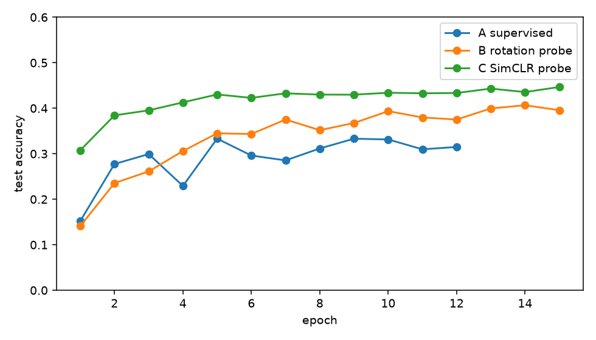
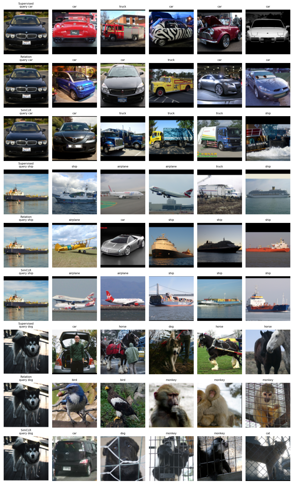

# DATA 266 — Homework 6

Sneha Singh  
SID4 = 0670 | SEED = 670 | SLICE = 670 | HP_ID = 4 | CLS_A = 0 | CLS_B = 5

Notebook: `stl10_ssl.ipynb`. Dataset: STL-10. Backbone: ResNet-18, no pretrained weights.

Same SID/SEED as HW1. No extra HP_ID network. The three trained models are supervised, rotation SSL, and SimCLR.

I ran this on Colab GPU (cuda).

## Part A — Supervised, 10% labels

500 images from the 5,000-image train split, index list saved with seed 670. End-to-end ResNet-18, 12 epochs, Adam, lr 0.001, batch 64. Test set is all 8,000 images.

Train loss went from 2.1113 to 0.1566. Test accuracy ended at **0.3149**. The best epoch in that run was epoch 5, at 0.3332.

## Part B — Rotation

All 100,000 unlabeled images. Predict 0°, 90°, 180°, or 270°. 15 epochs. Rotation loss went from 0.9339 to 0.2940.

I removed the 4-way head, froze the encoder, and trained a linear layer on the same 500 images for 15 epochs. Trainable weights in that step: 5,130. Test accuracy **0.3957**.

## Part C — SimCLR

20,000 unlabeled images. Two views. Augmentations: random resized crop, horizontal flip, color jitter, Gaussian blur. Projection MLP 512 → 128 → 128. Cosine similarity, τ = 0.2. 15 epochs. Contrastive loss went from 4.1709 to 2.2241.

I removed the projection head, froze the encoder, and trained a linear layer on the same 500 images for 15 epochs. Test accuracy **0.4467**.

## Test accuracy

| Model | Test accuracy |
|-------|--------------:|
| A supervised | 0.3149 |
| B rotation | 0.3957 |
| C SimCLR | 0.4467 |

SimCLR is the best. It learned from two views of each unlabeled image before it ever saw a class label. Rotation used more unlabeled images (100,000 vs 20,000) and still finished lower, because the pretext task is only the rotation. Supervised saw the real labels and only 500 images, so the train loss collapsed and the test accuracy stayed near 0.31.

## What I would change

- Supervised: augment the 500 images, and stop around epoch 5. A larger labeled fraction would matter more than more epochs.
- Rotation: add color jitter, and train the linear probe longer. Probe loss was still 1.5852 at epoch 15.
- SimCLR: use all 100,000 unlabeled images, train past 15 epochs, and use a larger batch than 128.

## Part D — Nearest neighbors

Same three test queries for every encoder: 3806 car, 1720 ship, 2051 dog. Top 5 by cosine similarity on the frozen 512-d features.

Car: supervised and rotation each return 4 cars and 1 truck. SimCLR returns 1 car, 3 trucks, and 1 ship.

Ship: rotation and SimCLR each return 3 ships. Supervised returns 2 ships, then airplanes and a truck.

Dog: supervised returns 1 dog. SimCLR returns 1 dog. Rotation returns 0 dogs (birds and monkeys).

SimCLR wins the 8,000-image probe. On this car query its neighbors are the loosest. The grid is three images, and it shows that similar-looking classes still sit next to each other, especially animals.
